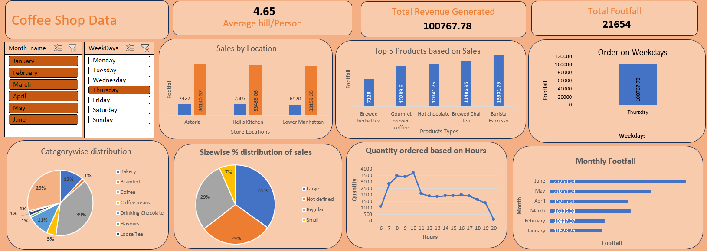

## 📊 Coffee Shop Sales Analysis Project

## 🔍 Project Overview

This project focuses on analyzing sales performance of a coffee shop using structured business data. The goal is to extract meaningful insights related to revenue, customer behavior, and sales trends to support data-driven decision making.

## 🎯 Objectives

* Analyze total revenue and customer footfall
* Identify sales trends by location and time
* Understand customer purchasing behavior
* Highlight top-selling products and categories
* Improve business performance through insights

## 📈 Key Insights

* Analyzed **Total Revenue ($698K+)** and **Footfall (149K+)** to evaluate overall performance
* Identified **average bill per customer ($4.69)** to understand spending patterns
* Tracked **sales trends by location** to compare store performance
* Analyzed **weekly, monthly, and hourly order patterns** to find peak sales periods
* Highlighted **top-selling products** and **category-wise revenue contribution**

## 🖼 Dashboard Preview

> *Interactive Power BI dashboard visualizing revenue, footfall, trends, and product performance.*

## 🛠 Tools & Technologies

* Microsoft Excel
* Power BI
* SQL (for advanced data analysis)
* Data Cleaning & Transformation Techniques

## 📌 Business Value

This analysis helps stakeholders:

* Optimize store operations
* Improve product strategy
* Increase revenue through better customer targeting
* Make informed business decisions using data insights

## 📂 Dataset

The dataset includes transactional sales data such as:

* Order details
* Product categories
* Sales amount
* Time and location information
